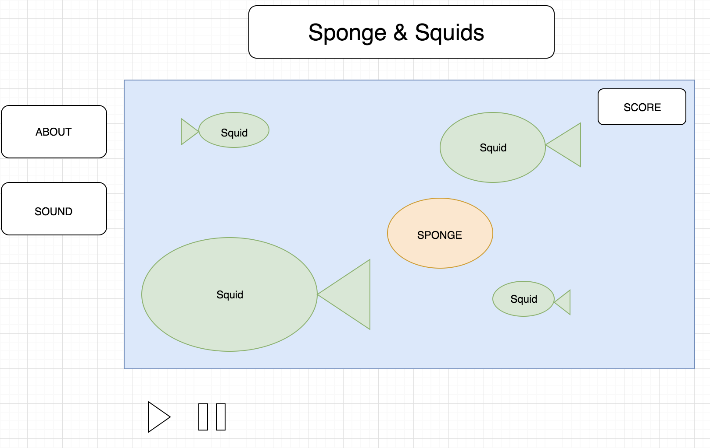

# Sponge & Squids

## Background
Sponge & Squids is a fun and interactive game where a user(sponge) attempts to push the limits of just how long he/she can avoid those horrible squids! 

## Functionality
The player will be able to move their sponge around the screen using the keyboard keys 'W', 'A', 'S', 'D' representing the four cardinal directions.

## Wireframes
* This app will consist of a single screen with the simulation canvas, Play/Pause controls, and the About and Details modals.
* Playback controls along the bottom will include Start and Pause.
* On the left, there will be an menu allowing the user to view details of the game and toggle sound.

## Overview & Technologies
The application's core technologies will be comprised of Javascript, HTML &CSS. 
* Javascript will be used to deal with the actual logic of the game.
* HTML & CSS will be used to handle the aesthics of the game, improving user experience.

## Implementation Timeline
* Day 1: Completion of proposal, initial setup of repo both locally and on Github.
* Day 2: Complete Canvas demo.
* Day 3: Build out logic of game, have game playable on the console.
* Day 4: CSS and styling of game.
* Day 5: Completion of game.
* Days 6-7: Finish set-up, update Production ReadMe, final deploymemt. 